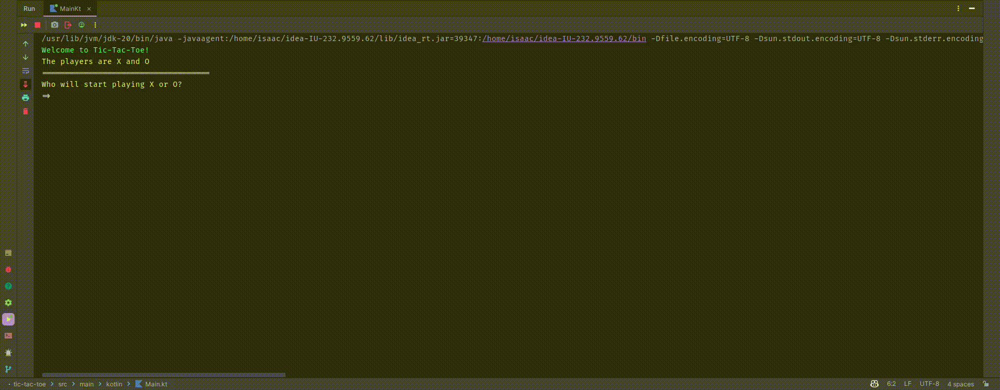

# Tic-tac-toe

That project is a simple console tic-tac-toe game built with Kotlin.

It was created as part of a mobile development assignment with the objective of reinforcing and applying Kotlin language concepts.

## Example

The game is played by two players on a 3x3 field.

